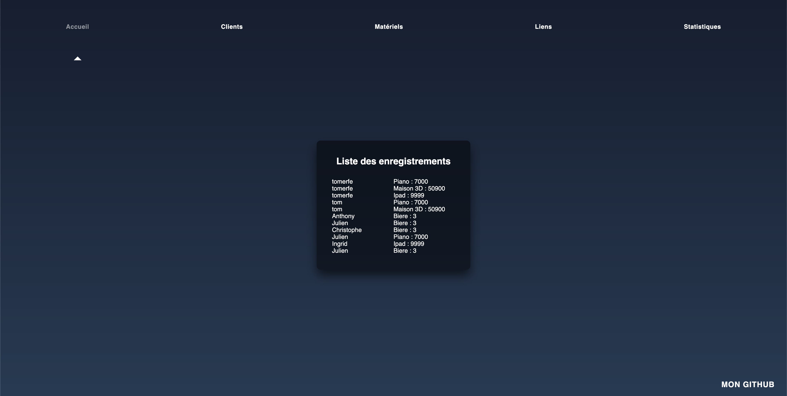
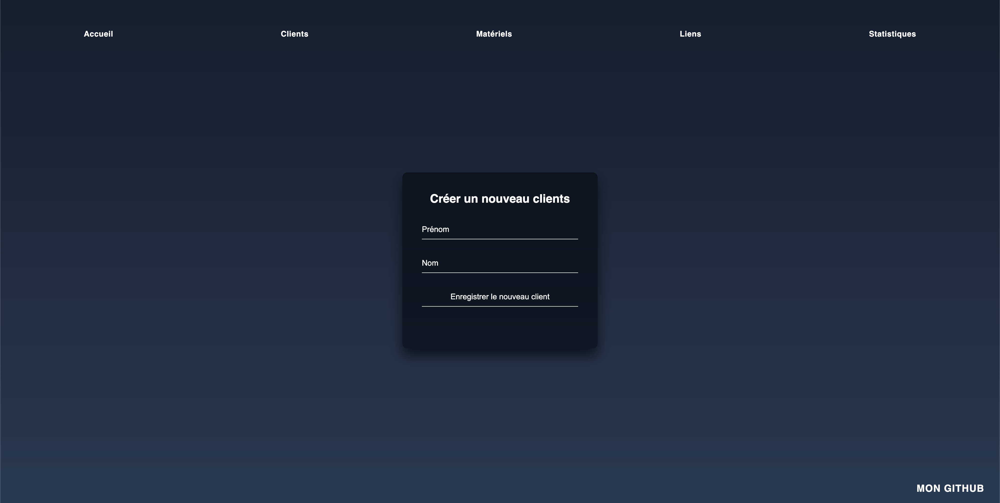
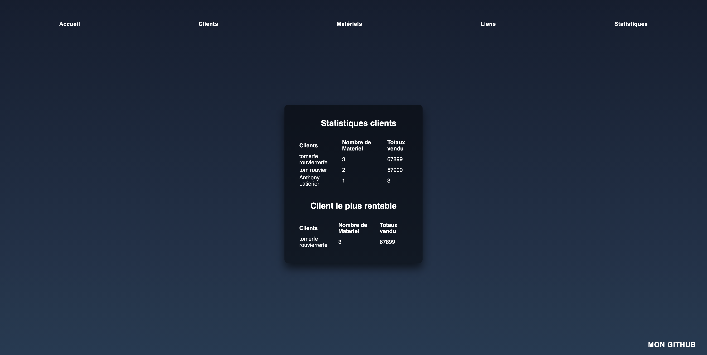

Symfony Demo Application
========================




The "Symfony Demo Application" is a reference application created to show how to develop applications following the [Symfony Best Practices][1].



Requirements
------------

  * PHP 7.3 or higher;
  * PDO-SQLite PHP;
  * Docker 20.10.6;
  * and the [usual Symfony application requirements][2].

Installation
------------

[Download Symfony][4] to install the `symfony` binary on your computer and run
this command:

Usage
-----

There's no need to configure anything to run the application. If you have
[installed Symfony][4] binary, run this command:

```bash
$ cd symfony-webapp/
$ docker-compose up -d
```

And

```bash
$ docker exec -it www_docker_symfony bash
/var/www# cd project
/var/www/project# php bin/console doctrine:database:create
Created database `db_name` for connection named default
/var/www/project# php bin/console make:migration
```

or without docker:

```bash
$ cd symfony-webapp/project/
$ symfony serve:start -d
```

Then access the application in your browser at the given URL (without docker: <https://eukles-test.wip/> or <http://127.0.0.1:8741/> by default).

to use the built-in PHP web server or [configure a web server][3] like Nginx or Apache to run the application.

[1]: https://symfony.com/doc/current/best_practices.html
[2]: https://symfony.com/doc/current/reference/requirements.html
[3]: https://symfony.com/doc/current/cookbook/configuration/web_server_configuration.html
[4]: https://symfony.com/download